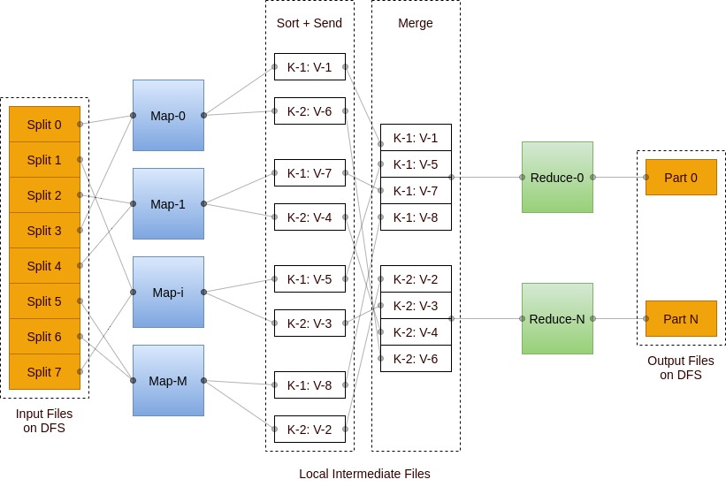

# photon-dance-mapreduce



## Get Started

### Prerequisites

* OS - debian/ubuntu linux release
* Go - go1.12.7 linux/amd64 or higher

### Installation

#### Clone

* Clone this repo to your local machine using https://github.com/amazingchow/photon-dance-mapreduce.git.

#### Example Usage

```shell
# build the plugin
cd apps && make build

# build the binary
cd .. && make build

# start the master service
./mapreduce-master-service --conf=conf/master_conf.json --level=info

# start the worker-1 service
./mapreduce-worker-service --conf=conf/worker_1_conf.json --level=info
# start the worker-2 service
./mapreduce-worker-service --conf=conf/worker_2_conf.json --level=info
# start the worker-3 service
./mapreduce-worker-service --conf=conf/worker_3_conf.json --level=info
```

## Documentation

### Api Design

* refer to [swagger](pb/mapreduce.swagger.json).

## Reference

* [MapReduce: Simplified Data Processing on Large Clusters](https://static.googleusercontent.com/media/research.google.com/en//archive/mapreduce-osdi04.pdf)

## Contributing

### Step 1

* 🍴 Fork this repo!

### Step 2

* 🔨 HACK AWAY!

### Step 3

* 🔃 Create a new PR using https://github.com/amazingchow/photon-dance-mapreduce/compare!

## Support

* Reach out to me at <jianzhou42@163.com>.

## License

* This project is licensed under the MIT License - see the **[MIT license](http://opensource.org/licenses/mit-license.php)** for details.
