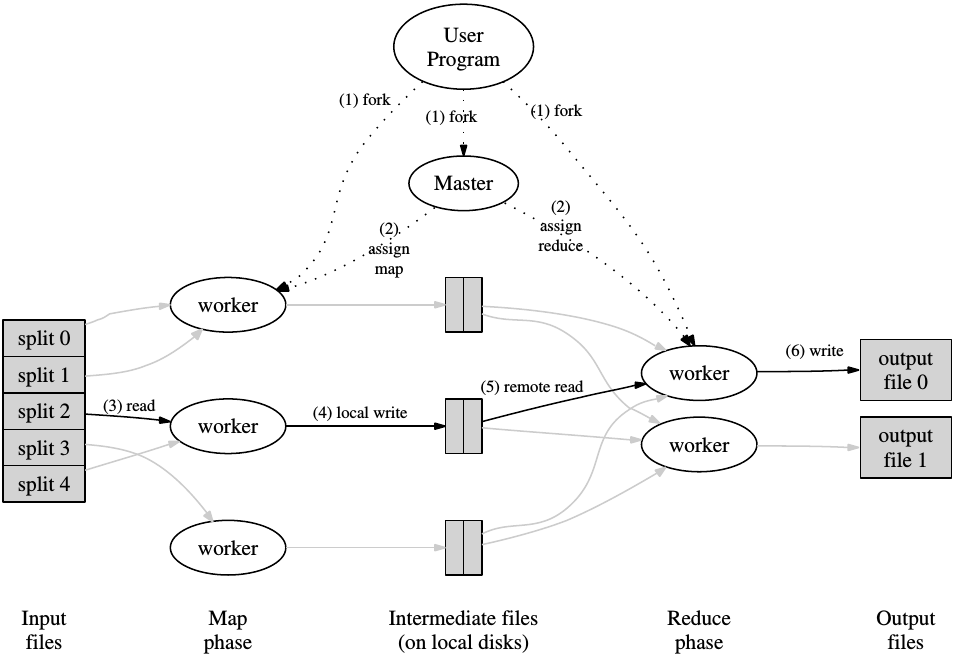

# mapreduce


``mapreduce execution overview (from Google's MapReduce paper)``

MapReduce
 is 
a kind of programming 
model 
for 
processing large scale 
data 
sets 
in 
a
 distributed 
fashion
 over 
a cluster of 
machines. The
 core 
idea 
behind 
MapReduce 
is
 mapping 
your 
data 
sets 
into 
a 
collection 
of
 {key,
 value} 
pairs,
 and 
then 
reducing 
over
 all 
pairs 
with
 the
 same 
key.

[](https://travis-ci.org/badges/badgerbadgerbadger) [](http://badges.mit-license.org) 

## Get Started

### Prerequisites

* OS: Linux
* Golang: v1.12+

### Installation

#### Clone

* Clone this repo to your local machine using https://github.com/amazingchow/leo.git.

#### Setup

```shell
# build the plugin
cd apps
make build
```

```shell
# build the binary
make build
```

```shell
# start the master service
./mapreduce-master-service --conf=conf/master_conf.json --level=info
```

```shell
# start the worker-1 service
./mapreduce-worker-service --conf=conf/worker_1_conf.json --level=info

# start the worker-2 service
./mapreduce-worker-service --conf=conf/worker_2_conf.json --level=info

# start the worker-3 service
./mapreduce-worker-service --conf=conf/worker_3_conf.json --level=info
```

#### Example

```shell
# add task
curl -XPOST -d \
    '{"task": {"inputs": ["/path/to/input-1.txt", "/path/to/input-2.txt", "/path/to/input-3.txt"]}}' \
    http://localhost:18180/v1/task
```

## Documentation

### Api Design

* refer to [swagger](pb/mapreduce.swagger.json).

## Reference

* [MapReduce: Simplified Data Processing on Large Clusters](https://static.googleusercontent.com/media/research.google.com/en//archive/mapreduce-osdi04.pdf)

## Contributing

### Step 1

* 🍴 Fork this repo!

### Step 2

* 🔨 HACK AWAY!

### Step 3

* 🔃 Create a new PR using https://github.com/amazingchow/mapreduce/compare!

## FAQ

* refer to [FAQ](FAQ.md).

## Support

* Reach out to me at <jianzhou42@163.com>.

## License

* This project is licensed under the MIT License - see the **[MIT license](http://opensource.org/licenses/mit-license.php)** for details.
